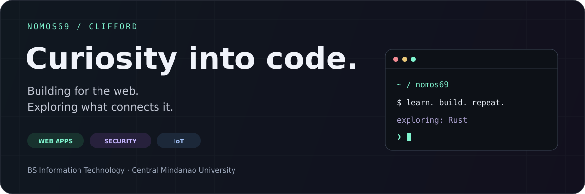

  

  <a href="https://github.com/Nomos69?tab=repositories"><b>Explore my projects ↗</b></a>
  &nbsp;&nbsp; / &nbsp;&nbsp;
  <a href="https://www.linkedin.com/in/rhimar-clifford-capunong-365704251/"><b>Connect on LinkedIn ↗</b></a>

 

### 01 / Behind the code

Hey, I'm **Clifford**, a BS Information Technology student at **Central Mindanao University**. I build full-stack applications with Laravel, Next.js, and MySQL, and explore how systems communicate and stay secure.

<table>
<tr>
<td width="50%" valign="top">

**BUILDING**

**RGMO-IRMS** — my capstone project for inventory and resource management.

</td>
<td width="50%" valign="top">

**EXPLORING**

Learning **Rust** and working through network security and pentesting with **Suricata, Pi-hole, Nmap, and Aircrack-ng**.

</td>
</tr>
</table>

### 02 / My toolkit

  

**Web:** PHP · Laravel · Next.js · TypeScript · MySQL 
**Also working with:** Python · Java &nbsp; / &nbsp; **Learning:** Rust

### 03 / Selected work

#### 🎮 &nbsp; [Pixelled ↗](https://github.com/Nomos69/Pixelled)

A local multiplayer campus RPG prototype, bringing players together in a shared campus world.

`Python` `FastAPI` `WebSockets` `HTML Canvas`

---

#### 💧 &nbsp; [VCWD Water Leakage Monitoring ↗](https://github.com/Nomos69/VCWD-Water-Leakage-Monitoring)

Smart water management for Valencia City with real-time sensor monitoring.

`Dart` `IoT` `Sensor monitoring`

---

#### 🖥️ &nbsp; [Richard Capunong Portfolio ↗](https://github.com/Nomos69/RichardCapunong)

A work portfolio for Richard Capunong.

`TypeScript` `Web development`

 

### 04 / Build something together

I'm open to collaborating on **web applications, IoT, and security-focused projects**.

**[Let's connect on LinkedIn →](https://www.linkedin.com/in/rhimar-clifford-capunong-365704251/)**

---

Learning by building, one project at a time.

<!-- Visual sources and licensing: DESIGN.md -->
